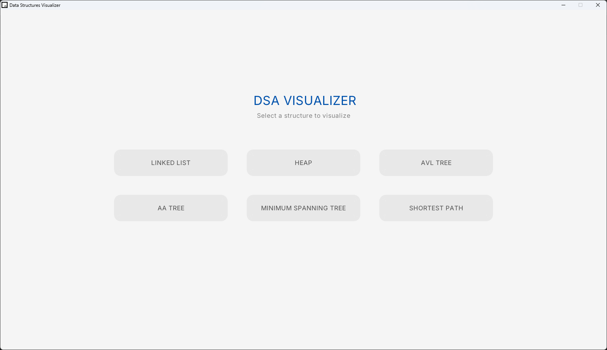
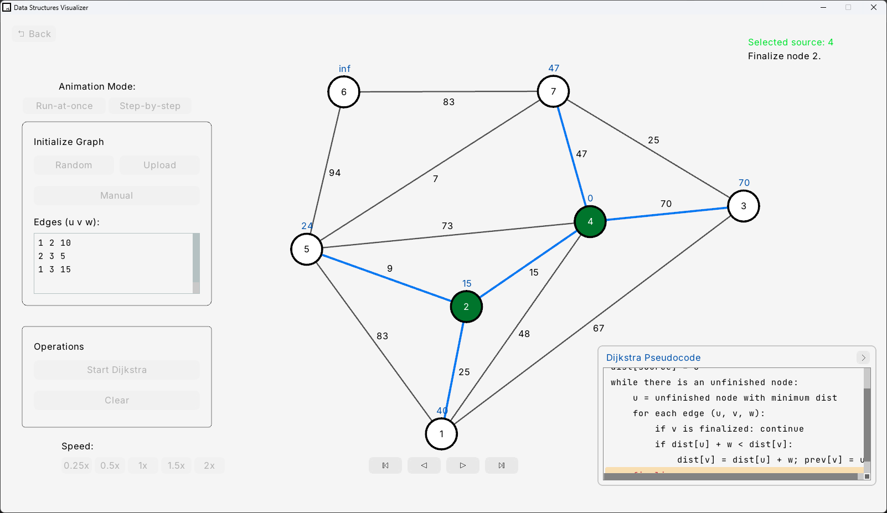

# Data Structures & Algorithms Visualizer

An interactive, desktop-based graphical application designed to help students and developers comprehend complex Data Structures and Algorithms (DSA). Built entirely in C++ using the Raylib framework, this tool visualizes the step-by-step execution of fundamental and advanced data structures.



## Supported Data Structures & Algorithms

*   **Linked List**: Insertion, Deletion, Search, and Update operations.
*   **Max Heap**: Push and Pop operations with real-time array-to-tree visual mapping.
*   **AVL Tree**: Insertion, Deletion, and Search operations including self-balancing rotations (LL, RR, LR, RL).
*   **AA Tree**: Insertion, Deletion, and Search operations featuring `skew` and `split` level balancing.
*   **Minimum Spanning Tree (Kruskal's)**: Graph edge sorting, union-find visualization, and interactive force-directed graph generation.
*   **Shortest Path (Dijkstra's)**: Graph traversal finding the shortest path between a source node and all other nodes.

## Key Features

*   **Interactive Playback Controls**: Step forward, step backward, pause, and play animations line-by-line using a robust time-travel snapshot history system.
*   **Synchronized Pseudocode**: A collapsible code panel continuously tracks the algorithm's progression, highlighting the exact code line currently being executed.
*   **Adjustable Animation Speed**: Change the speed of the visualizer dynamically on the fly (`0.25x`, `0.5x`, `1.0x`, `1.5x`, `2.0x`).
*   **Custom Data Input**: Input data manually, randomize the current structure, or upload a `.txt` file via native OS file dialogs.
*   **Interactive Graph Nodes**: Click and drag vertices in graph algorithms (Dijkstra and Kruskal) seamlessly via a built-in physics spring-layout algorithm.



## Technologies Used

*   **Raylib**: A simple and easy-to-use C library for video games and graphics programming.
*   **Raygui**: A simple and easy-to-use immediate-mode GUI library.
*   **TinyFileDialogs**: Cross-platform standard dialogs for C/C++.
*   **C++ Standard Library**: Heavily relies on `std::vector`, `std::string`, `std::stringstream`, and other STL features.

## Build Instructions

This project uses a standard `Makefile` configuration tailored for C++ with Raylib.

### Installation
First, you need to clone the repository:
```bash
git clone https://github.com/chautanphat/dsa-visualizer.git
```

### Prerequisites (Windows)
1.  Install **w64devkit** (which provides GCC and GNU Make) or another MinGW-w64 toolchain.
2.  Install **Raylib** to `C:/raylib/raylib`.

### Compilation
Open a terminal in the root directory of the project and run:
```bash
make
```
To clean the build directory and remove object files:
```bash
make clean
```

Once compiled successfully, an executable named visualizer.exe will be generated. Run it using:
```bash
./visualizer.exe
```

## Project Structure

*   `src/`: Contains all `.cpp` implementation files.
*   `header/`: Contains all `.h` header declarations.
*   `vendor/`: Third-party dependencies like `raygui.h` and `tinyfiledialogs.c`.
*   `Makefile`: Rules for compiling the application across multiple OS platforms.

---